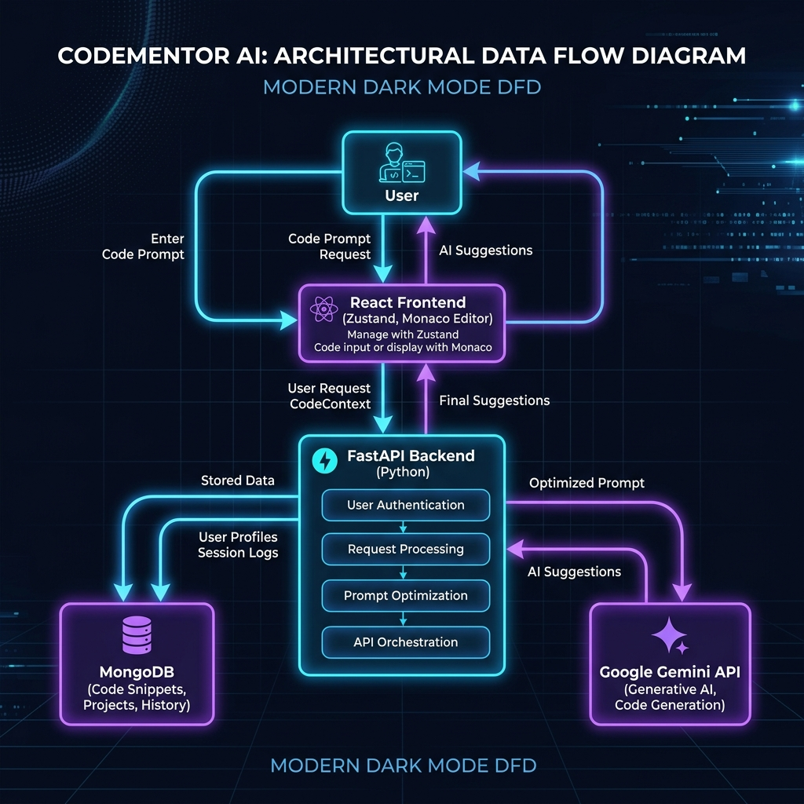
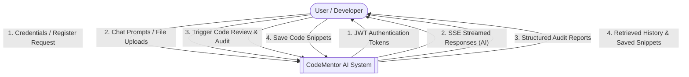
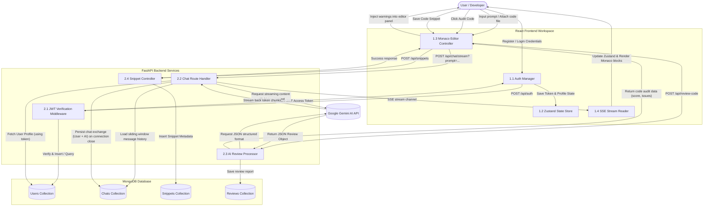

# Data Flow Diagram (DFD) - CodeMentor AI

This document provides a comprehensive analysis of data flow within the **CodeMentor AI** system. It details how data propagates from the user interface, through the backend servers and authentication layers, to the database and the Google Gemini AI reasoning engine.

---

## 🖼️ Architectural DFD Overview
Below is a high-level visual representation of the key system components and data pipelines in CodeMentor AI:

---

## 1. Level 0 DFD: Context-Level Diagram
The Context Diagram represents the system boundaries and highlights the data exchanges between the external entity (User/Developer) and the CodeMentor AI system.

---

## 2. Level 1 DFD: Process-Level Diagram
The Process-Level diagram decomposes the system into core components, showing how data streams between the Frontend App, FastAPI Backend, MongoDB Collections, and the Google Gemini API.

---

## 3. Data Dictionary (Key Flows)

| Data Flow Name | Source | Destination | Description | Key Data Fields |
| :--- | :--- | :--- | :--- | :--- |
| **Credentials** | User | 1.1 Auth Manager | Login or sign-up information submitted by the user. | `name`, `email`, `password` |
| **JWT Access Token** | 2.1 Auth Middleware | 1.2 Zustand Store | Secure token generated upon validation for stateless verification. | `access_token`, `token_type` |
| **Chat Stream Request** | 1.3 Monaco/Chat | 2.2 Chat Handler | Outbound chat trigger containing the user prompt and context identifiers. | `prompt`, `chatId`, `systemPrompt` |
| **Sliding Window History** | D2 Chats Store | 2.2 Chat Handler | Truncated collection of previous messages to prevent token context overload. | `[ { role, content, timestamp } ]` |
| **Token SSE Stream** | 2.2 Chat Handler | 1.4 SSE Reader | Event-driven chunks pushed in real-time to the frontend. | `event: message`, `data: { token }` |
| **JSON Review Report** | Gemini API | 2.3 Review Processor | Structured evaluation report returned by Gemini for code auditing. | `{ score, summary, issues: [ { type, severity, line, description } ] }` |
